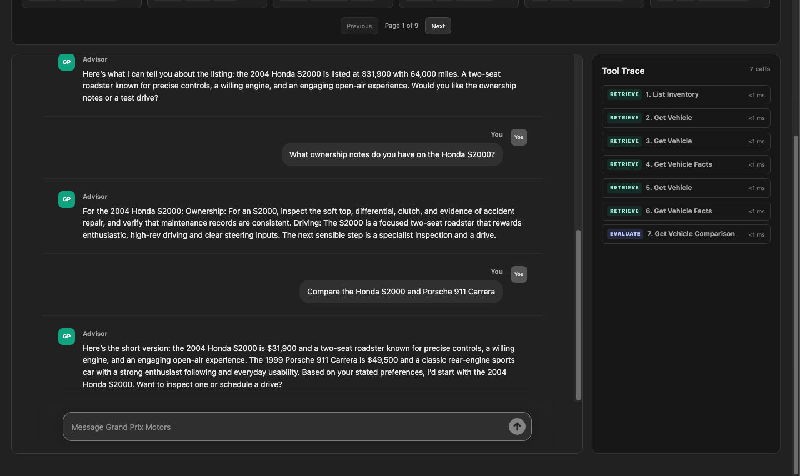

# Classic Sports Car Sales Agent

## What it is

A sales agent for classic and modern-classic enthusiast sports
cars. It combines deterministic business logic, typed domain tools, inventory
retrieval, curated vehicle reviews, and CrewAI orchestration.

## Install

Requires Python 3.12 and Node.js/npm. From the repository root:

```bash
# Backend
python3.12 -m venv .venv
source .venv/bin/activate
python -m pip install -e '.[dev]'

# Frontend
npm --prefix frontend install
npm --prefix frontend run build
```

For live CrewAI/OpenRouter responses, add this to `.env`:

```env
OPENROUTER_API_KEY=your-key
CAR_AGENT_CREWAI_MODEL=openrouter/deepseek/deepseek-chat
```

## Run the app

```bash
# If needed in a new terminal:
source .venv/bin/activate

uvicorn car_agent.app:app --reload
```

Open [http://127.0.0.1:8000/](http://127.0.0.1:8000/).

The UI provides an assistant-ui chat interface, inventory gallery, and live
Tool Trace panel. The frontend build is served by FastAPI at `/`.

## Deploy to Hugging Face Spaces

This project is packaged as a Docker Space. Create a Docker Space in Hugging
Face with your preferred visibility, then add `OPENROUTER_API_KEY` as a Space
**Secret** under **Settings → Variables and secrets**. You may also set the
optional `CAR_AGENT_CREWAI_MODEL` variable.

Commit the deployment files, add your SSH public key in [Hugging Face SSH
settings](https://huggingface.co/settings/keys), then verify the connection
with `ssh -T git@hf.co` before deploying:

```bash
git add README.md Dockerfile .dockerignore .gitignore scripts/deploy_huggingface.sh
git commit -m "Configure Hugging Face Space"
./scripts/deploy_huggingface.sh
```

The script runs a local Docker build before pushing the current branch to the
Space. If Docker Desktop is unavailable, omit that optional preflight build
with `SKIP_DOCKER_BUILD=1 ./scripts/deploy_huggingface.sh`; Hugging Face will
still build the image after the push. The application keeps conversations and
test-drive requests in memory, so that state resets when the Space restarts or
sleeps.

## UI preview

Example run covering inventory search, vehicle details, ownership facts, and a
comparison. The right rail shows the accumulated Tool Trace.



## Architecture and design

- React and assistant-ui provide the chat and inventory gallery.
- FastAPI exposes the UI and JSON/SSE API.
- `CrewAISalesAgent` coordinates deterministic routing and LLM CrewAI turns.
- Pydantic models define inventory, conversation state, tool results, reviews,
  and API responses.
- Typed tools ground responses in inventory, exact vehicle lookup, vehicle
  facts, service history, magazine reviews, comparisons, and test-drive
  scheduling.
- Conversation state and the test-drive scheduler are in memory. Inventory and
  source records are loaded from JSON fixtures.
- Tool calls include phase, purpose, outcome, duration, and redacted arguments;
  the UI receives them through the existing SSE stream.

## Available tools

| Tool | Purpose |
|---|---|
| `list_inventory` | List ranked inventory records using shopper filters and query terms. |
| `lookup_vehicle_exact` | Verify exact year, make, and model availability, including family matches. |
| `get_vehicle` | Load one complete inventory listing. |
| `get_vehicle_facts` | Get sourced ownership and vehicle facts. |
| `get_service_history` | Get listing-level service records and provenance. |
| `get_magazine_reviews` | Get curated magazine reviews and source links. |
| `get_vehicle_comparison` | Get a comparison of two inventory vehicles. |
| `create_test_drive` | Create a test-drive request after validation. |

## API endpoints

| Method | Endpoint | Purpose |
|---|---|---|
| `GET` | `/` | Serves the web UI. |
| `GET` | `/health` | Returns application health. |
| `GET` | `/inventory?limit=12` | Returns typed inventory listings. |
| `POST` | `/chat` | Processes a shopper message and returns the response, state, and tool trace. |
| `GET` | `/vehicles/{vehicle_id}/reviews` | Returns curated reviews for a listing. |

`POST /chat` body:

```json
{
  "conversation_id": "shopper-1",
  "message": "Do you have a BMW Z4?"
}
```

Clients requesting `Accept: text/event-stream` receive trace events and
response deltas as the turn runs. Standard clients receive one JSON response.
